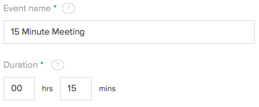
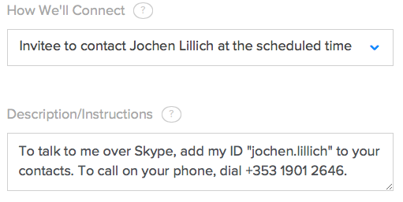
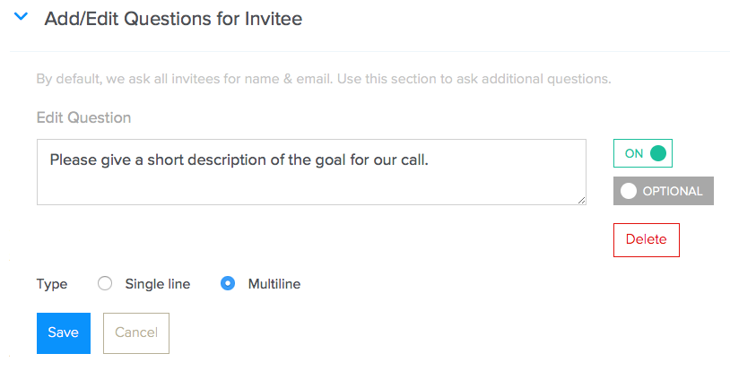
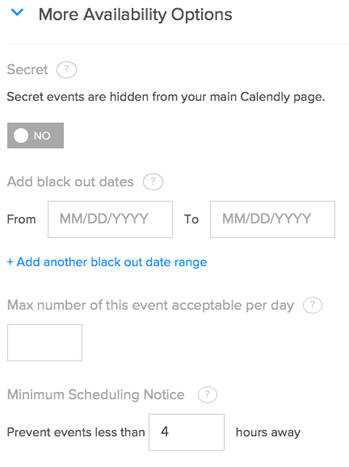

# Scheduling via Calendly

We use [calendly.com](https://calendly.com/) as our tool for scheduling calls, especially with external parties.

## Setup

After you’ve received an invitation to Calendly.com, you’ll have to set up your account.

For your public URL, use the schema “freistil-yournickname”, e.g. “freistil-jochen”.

You can define different event types; usually these are calls of different lengths.

We recommend you let the other party initiate the call via Skype or phone:

Make sure to add an extra field so you get a few details what the appointment is all about:

If you’d like to avoid short-term appointments, set a minimum notice time:

